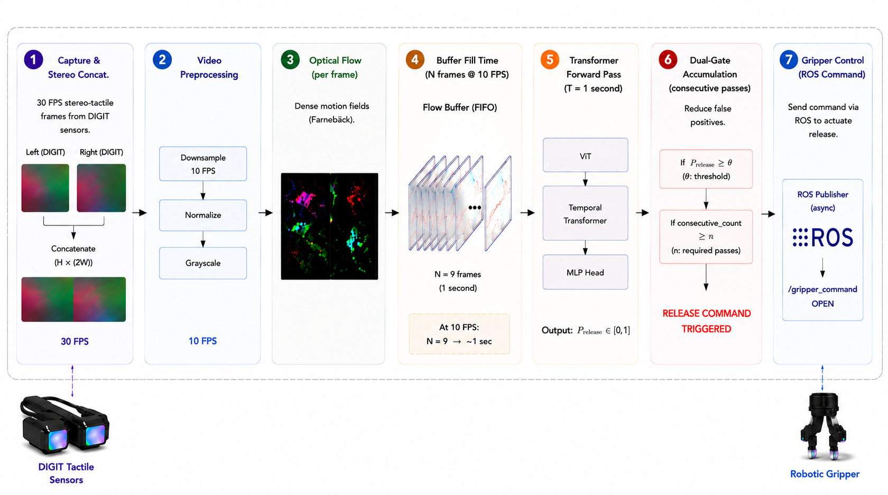

# Hi, I'm Mor Salah 
## M.Sc. Researcher | Machine Learning | Intelligent Sensing | Real-Time System

I am an engineer with 7+ years of experience in semiconductor manufacturing, process engineering, statistical data analysis, and multidisciplinary engineering across high-volume manufacturing and applied research environments.

Throughout my career at Intel, Exyte, and ADAMA, I have worked on process optimization, system validation, engineering modeling, failure analysis, and data-driven decision making to improve manufacturing performance and operational reliability.

As an M.Sc. Researcher at Tel Aviv University, I extend this experience through the development of intelligent sensing systems, machine learning models, experimental design, and real-time data analysis. My research combines hardware, software, and AI to solve complex engineering problems in multidisciplinary environments.

I am passionate about applying engineering, data analytics, and machine learning to develop reliable, high-performance systems and solve real-world manufacturing and product challenges.

##  Industrial Engineering Foundation

* **Intel Corporation**
  * **Statistical Process Control (SPC):** Advanced data analytics (JMP/Excel) to stabilize high-volume manufacturing parameters (CD, Overlay, Dose).
  * **Design of Experiments (DOE):** Systematic matrix evaluations to mitigate recurring process anomalies and establish robust operational windows.
  * **Root-Cause Analysis (RCA):** Systematic troubleshooting of complex production excursions to minimize equipment downtime.

* **ADAMA Ltd.**
  * **Complex Systems Commissioning:** Scale-up and functional validation of advanced chemical manufacturing infrastructure and automated control system loops.
  * **Process-Mechanical Troubleshooting:** Cross-functional root-cause resolution of electromechanical anomalies during early operational phases.
  * **Multidisciplinary System Validation:** Collaborative performance testing to ensure end-to-end operational readiness and safety standards.

* **Exyte**
  * **Predictive Modeling & Simulation:** Data-driven scenario forecasting using Pipeflow to optimize infrastructure reliability and performance.
  * **Infrastructure Simulation:** Quantitative trade-off analysis of equipment scalability, system redesigns, and resource timing.
  * **Technical Roadmapping:** Translating multi-variable simulations into actionable infrastructure roadmaps for executive and engineering stakeholders.
---
## Research Overview

**Real-Time Tactile Sensing for Human-Robot Handover** 

M.Sc. Thesis (Paper submitted - Seeing Contact Move: A Transformer-Based Framework for Real-Time Tactile Human-Robot Handover Recognition)

Developed an end-to-end real-time tactile sensing system that predicts human release intent from tactile sensor data and enables autonomous robotic object handover.
My research develops an end-to-end tactile perception framework that transforms raw tactile sensor streams into robotic actions using:

### Key Contributions

• Built a complete ROS-based tactile perception and robotic control pipeline

• Developed a motion-centric tactile representation robust to DIGIT sensor degradation and illumination artifacts

• Designed a hybrid Vision Transformer (ViT) + Temporal Transformer architecture

• Successfully deployed on physical robotic hardware

• Collected and curated a dataset containing:

* 23,274 tactile interaction sequences
* 406 robotic interaction recordings
* Unseen-object evaluation protocol

• Achieved:

* 89% Test Accuracy on unseen objects
* 87% Accuracy during real-time robotic deployment

---
## Research Results

| Metric                        | Result                |
| ----------------------------- | --------------------- |
| Test Accuracy                 | 89%                   |
| Real-Time Deployment Accuracy | 87%                   |
| Dataset Size                  | 23,274 Sequences      |
| Recorded Trials               | 406 Videos            |
| Model Inference Time          | 148 ms                |
| End-to-End System Latency     | 822 ms                |
| Deployment Platform           | ROS Noetic            |
| Sensor Platform               | DIGIT Tactile Sensors |

---

<h3>End-to-End Real-Time Intelligent Sensing System</h3>
<h4>Successful Release Event</h4>

  

  <strong>Model Detects Release Intent (~148ms)</strong>
   
  Triggers physical gripper actuation.

# System Architecture 

  

  <b>End-to-End Real-Time Intelligent Sensing System</b>

End-to-End Engineering System integrating tactile sensing, machine learning, real-time processing, and system validation.
---

##  Core Technical Skills
### AI & Machine Learning

  
  
  

### Real-Time Systems

  
  

## Connect Details

💼 LinkedIn
https://www.linkedin.com/in/mor-salah/

📧 Email
[morsalah55@gmail.com](mailto:morsalah55@gmail.com)

📍 Location
Beer Sheva, Israel

